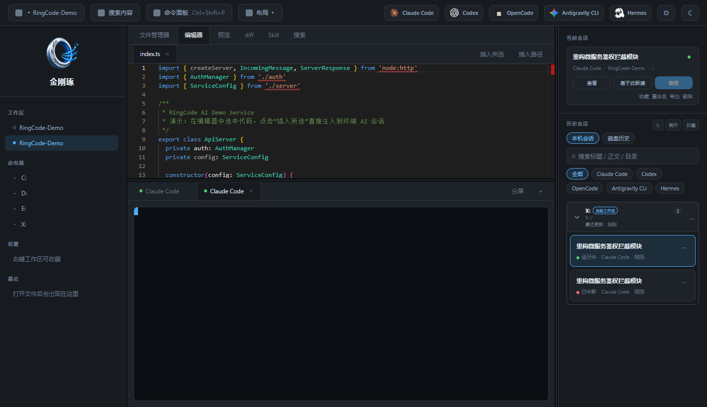
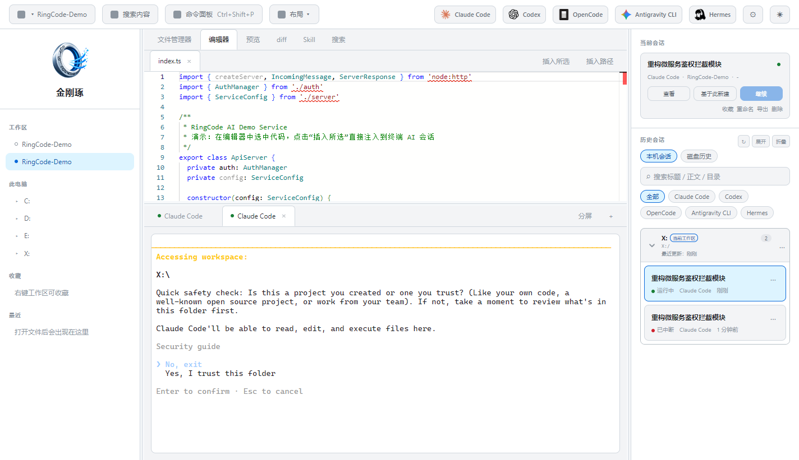

# 金刚琢 RingCode

<p align="center">
  <strong>以本地工作区为中心的 Windows 原生 AI 辅助开发工作台</strong>
</p>

<p align="center">
  
  
  
  
  
</p>

---

### 📖 命名渊源与设计哲学

> *“当年过函谷关，化胡为佛，甚是亏它。早晚最可防身。等我丢下去打他一下。” ——《西游记》第六回*  
> *“这件物，本是锟钢抟炼的，被我将甚神丹点化，着了一点灵气，变化无穷，水火不侵，又能套诸物，一名‘金钢琢’，又名‘金钢套’。” ——《西游记》第五十二回*

在古典神话中，太上老君的**金刚琢**（又名金钢套）是锟钢抟就、神丹点化的无上至宝，**水火不侵、能套诸般兵刃法宝，可纳天地万物**。

迈入大模型与多 Agent 协同时代，开发者的武器库迎来了前所未有的爆发：Claude Code、OpenAI Codex、OpenCode、Google Antigravity CLI、Hermes…… 各路命令行 Agent 神兵利器层出不穷。然而，随之而来的却是工具碎片化、终端与编辑器割裂、频繁切屏粘贴以及上下文丢失的混乱。

**金刚琢（RingCode）** 承载着这一文化意向应运而生：
- 🌀 **纳万物**：取金刚琢“收纳万物神兵”之意，将各路 CLI Agent、Monaco 编辑器、ConPTY 深度定制原生终端、工作区文件系统与 Git 全要素收纳归一；
- 🎯 **归一琢**：化繁为简，归于一处。告别分散无序的多窗口疲惫切换，以一个本地优先、系统级受控的“驾驶舱”，套住各路 Agent 神兵，**纳天下 Agent 为我所用，如臂使指**。

---

## 📸 界面预览

### 深色驾驶舱（Dark Cockpit · 默认）


### 浅色模式（Light Theme）


---

## ✨ 核心特性

- 🤖 **多 Agent 原生聚合驱动**
  - 原生适配并深度集成主流 AI 编程 Agent：**Claude Code**、**Codex CLI**、**OpenCode**、**Antigravity CLI**、**Hermes**，并支持自定义扩充。
  - **Claude / Codex 分身**：从原版复制入口，独立 Key、URL、模型与权限；会话历史仍共用默认家目录。创建/编辑时可拉取模型列表。继续会话默认上次入口，可改选同家族原版或另一个分身。
  - 顶栏最多 4 个具名入口，其余收入「更多」；显隐同时作用于顶栏和更多列表，不影响历史、命令面板与快捷键。
  - 多终端 Tab 自由切换与分屏管理，各会话独立维持生命周期。

- 💻 **深度定制的 ConPTY 原生终端**
  - **括号粘贴模式（Bracketed Paste Mode）**：无论是单行指令还是数百行复杂代码，插入/粘贴均作为原子块整体注入，**绝不会因中间换行意外触发回车发送**。
  - **智能拖拽与路径转义**：直接把工作区文件或外部文件拖拽至终端，自动转换为规范路径并完成安全 Shell 转义。
  - 深度支持快捷键穿透与 Windows 原生键盘交互。

- 📜 **会话历史双轨解析与恢复**
  - 无缝解析各 Agent 存放在本地磁盘的原生历史会话文件（如 Claude Code `history.jsonl`、Antigravity `transcript.jsonl`、Codex、OpenCode 等）。
  - 按项目工作区目录**智能分组归档**，支持一键检索历史对话并恢复 CLI 上下文。

- 📝 **开箱即用的 Monaco 编辑器**
  - 内置 VS Code 同款 Monaco Editor，支持数十种编程语言语法高亮、缩进与诊断。
  - **一键“插入所选” / “插入路径”**：在编辑器中选定任意代码段或文件路径，一键原子注入当前终端 AI 会话，辅助提问更顺手。
  - 支持 Markdown 实时渲染与分栏对照预览。

- 🔒 **本地优先与系统级安全沙箱**
  - **系统凭据安全托管**：API Key 等敏感凭据直接托付给 Windows 凭据管理器（Credential Manager），渲染层全程不接触明文密钥，不落日志、不进导出。
  - **进程隔离与路径受控**：开启 `contextIsolation`，关闭 `nodeIntegration`。文件读写、Git 操作、搜索及 PTY 当前路径受控在已登记的工作区白名单内。
  - 文件删除直达 Windows 系统回收站，保障代码资产安全。

- 🎨 **高精致度设计系统**
  - 专为长工时开发者定制的深色驾驶舱风格（Direction B），兼具浅色变体，支持跟随系统自动切换。

---

## 🚀 快速上手

### 1. 二进制免安装运行（推荐）

前往 [GitHub Releases](https://github.com/diaoerlangdang/RingCode/releases) 下载对应包装：

| 包装 | 文件名 | 用途 |
| --- | --- | --- |
| 免安装 | `RingCode-<版本>-x64.zip` | 解压后运行 `金刚琢.exe` |
| 安装版 | `RingCode-<版本>-x64.exe` | NSIS 安装，带开始菜单快捷方式 |

设置里「检查更新」会按**当前运行的是免安装还是安装版**，指向同一种包装。没有对应附件时只打开发布页，不会自动覆盖本地文件。

1. 免安装：下载 zip，解压到任意目录，双击 `金刚琢.exe`（无需 Node.js 或 C++ 环境）。
2. 安装版：运行 exe，按向导安装。

### 2. 源码本地运行与开发

#### 环境要求
- Windows 10 / 11 (x64)
- Node.js 22.x（Vitest 4 跑完整测试需要；勿用 Node 18）
- C++ 构建工具（`better-sqlite3` 与 `node-pty` 原生模块依赖）

#### 启动开发
```bash
# 1. 克隆代码仓库
git clone https://github.com/diaoerlangdang/RingCode.git
cd RingCode

# 2. 安装依赖
npm install

# 3. 启动桌面开发环境（Vite 5174 + Electron）
npm run electron:dev

# 仅启动 Web 模式（Mock Shell 兜底）
npm run dev
```

#### 检查与打包
```bash
# 执行类型检查与单元测试（当前 51 个文件 / 237 项）
npm run typecheck
npm test

# 生产打包：安装版 exe + 免安装 zip
npm run electron:build
```

产物在 `release/RingCode-<version>-x64.zip` 与 `.exe`。解压后的可执行文件仍是 `金刚琢.exe`。完整发版步骤（禁止手压 zip、附件必须 ASCII、网页上传核对）见 [docs/发版打包.md](docs/发版打包.md)。

---

## 🛠️ CLI Agent 环境推荐与配置

金刚琢会自动检测系统中已安装的 CLI 工具，您只需确保对应的命令在 Windows 系统 PATH 中可用：

| Agent | 推荐安装 / 获取方式 | 核心适配特性 |
| --- | --- | --- |
| **Claude Code** | `npm install -g @anthropic-ai/claude-code` | 解析 `history.jsonl`，支持 `--resume` / `--fork-session`；可复制分身 |
| **Codex** | 官方 Codex CLI（`codex`） | `--resume` / `fork`；分身用 overlay，不改用户主 `config.toml` |
| **OpenCode** | 参考官方 OpenCode CLI 安装文档 | 自动捕获会话历史 |
| **Antigravity CLI** | 安装 Google Antigravity 官方 CLI (`agy`) | 自动索引 `transcript.jsonl` |
| **Hermes** | 接入 Hermes 自动化 Agent 终端 | 自动化调度 |

*注：在「设置」中配置 API Key，凭据存放在 Windows 凭据管理器。分身缺 Key 时 RingCode 会拦截启动；原版 Claude / Codex 仍可走 CLI 登录。*

---

## 📐 项目结构

```text
RingCode/
├── electron/                 # Electron 主进程
│   ├── main.ts               # 主窗口、受控 IPC
│   ├── ptyLifecycle.ts       # ConPTY 与进程生命周期
│   ├── cred.ts               # Windows 凭据管理器
│   ├── pathSafe.ts           # 工作区路径白名单
│   ├── historyIndex.ts       # 磁盘历史检索
│   ├── cloneLaunchCli.ts     # 分身系统启动器入口
│   ├── cloneResources.ts     # 分身 overlay / 启动器文件
│   ├── cloneModels.ts        # 分身「获取模型列表」
│   ├── claudeSettingsWrite.ts# Claude 分身 --settings 覆盖
│   └── appUpdate.ts          # GitHub Release 检查更新
├── src/
│   ├── components/           # EditorPane, TerminalView, FileManager, QuickLaunchCluster...
│   ├── lib/agents.ts         # 内置 Agent 适配器
│   ├── lib/agentClone.ts     # 分身定义与校验
│   ├── lib/quickLaunch.ts    # 顶栏显隐与收纳
│   └── store/                # Zustand（persist v8）
├── docs/                     # 进度、分身规划、发版打包、历史规格
└── release/                  # 生产打包产物（RingCode-<version>-x64.zip / .exe）
```

---

## 🤝 贡献与反馈

欢迎提出功能想法、提交 Issue 或发起 Pull Request！
如遇到使用问题，请在 [GitHub Issues](https://github.com/diaoerlangdang/RingCode/issues) 提交时附带必要复现步骤。

---

## 📄 开源许可证

本项目遵循 [MIT License](LICENSE) 开源协议。您可以自由使用、修改、分发与商业化，仅需在衍生版本中保留原始版权声明。
